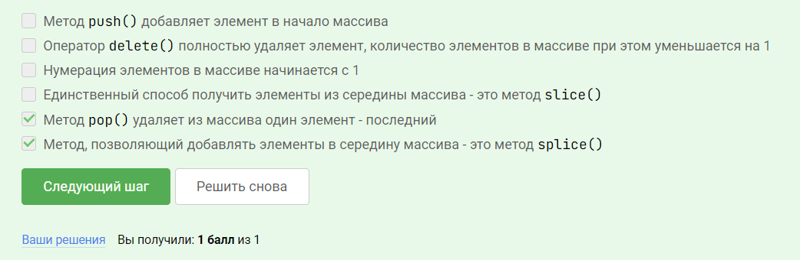
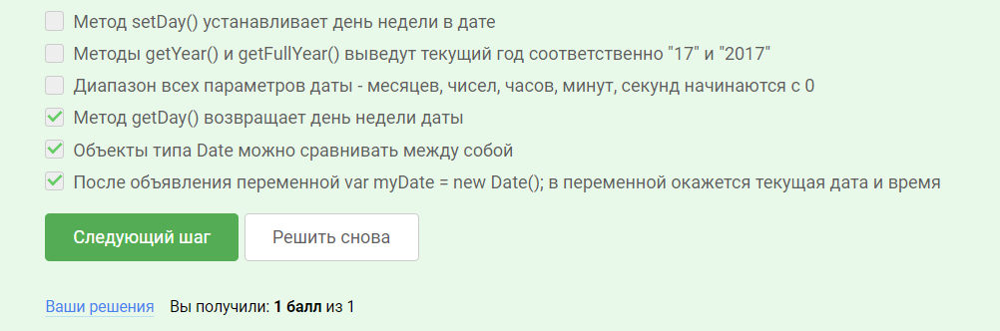

# Ответы на письменные задачи 

## Функции

- Отметьте все варианты корректного определения функции

- В этом тесте нужно отметить все правильные определения.

## Объекты

- Сопоставьте части высказываний максимально корректным образом.

- Теперь проверим, насколько понятно был изложен предыдущий материал!

## Массивы 

- Как всегда в конце урока сначала небольшой тест! Необходимо отметить все верные высказывания.

## Дата и время

- Перед финальным заданием этого урока ответим на несколько несложных вопросов для проверки понятности материала.

