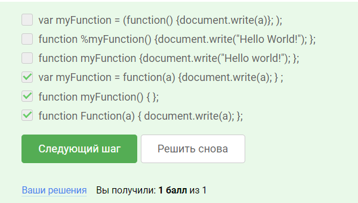
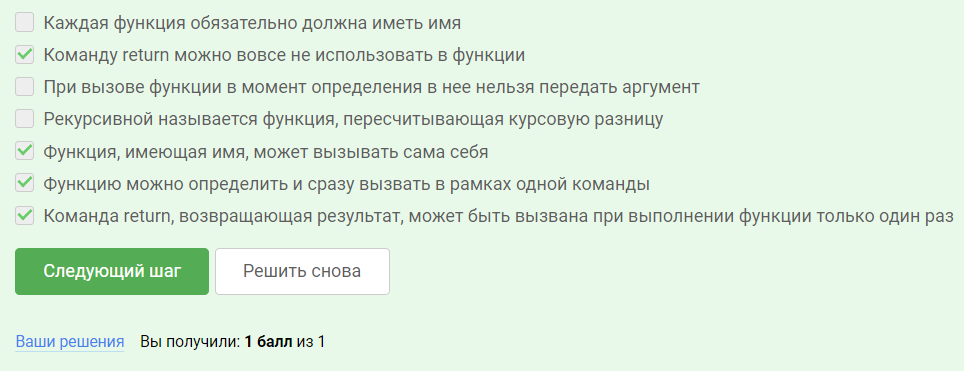
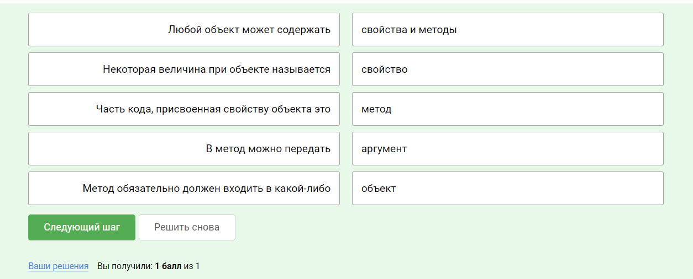
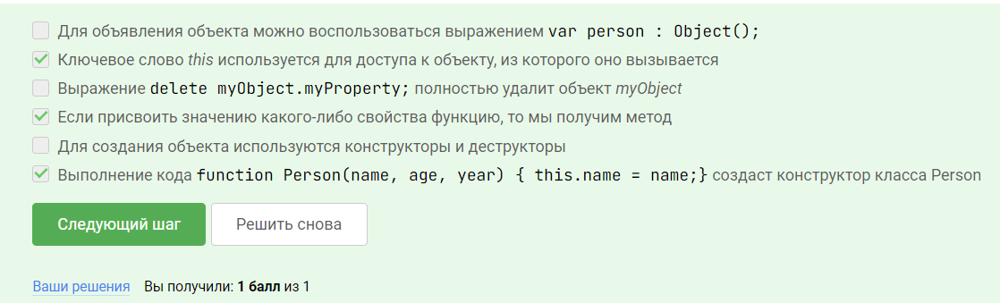

# Ответы на письменные задачи 

## Функции

- Отметьте все варианты корректного определения функции

- В этом тесте нужно отметить все правильные определения.

## Объекты

- Сопоставьте части высказываний максимально корректным образом.

- Теперь проверим, насколько понятно был изложен предыдущий материал!

