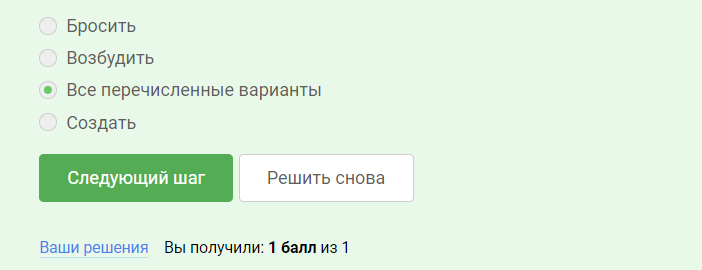
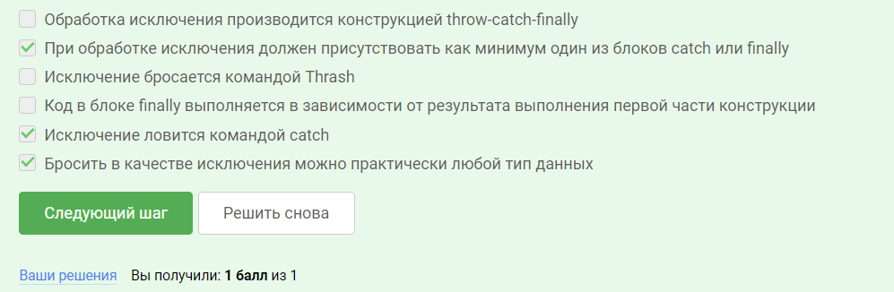
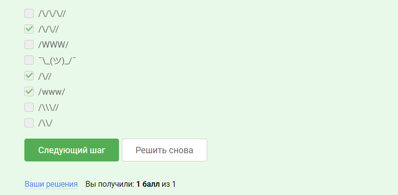
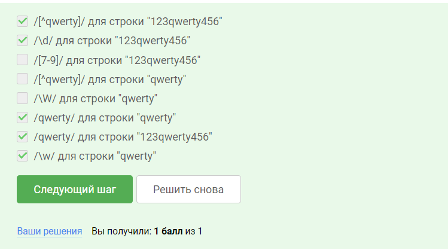
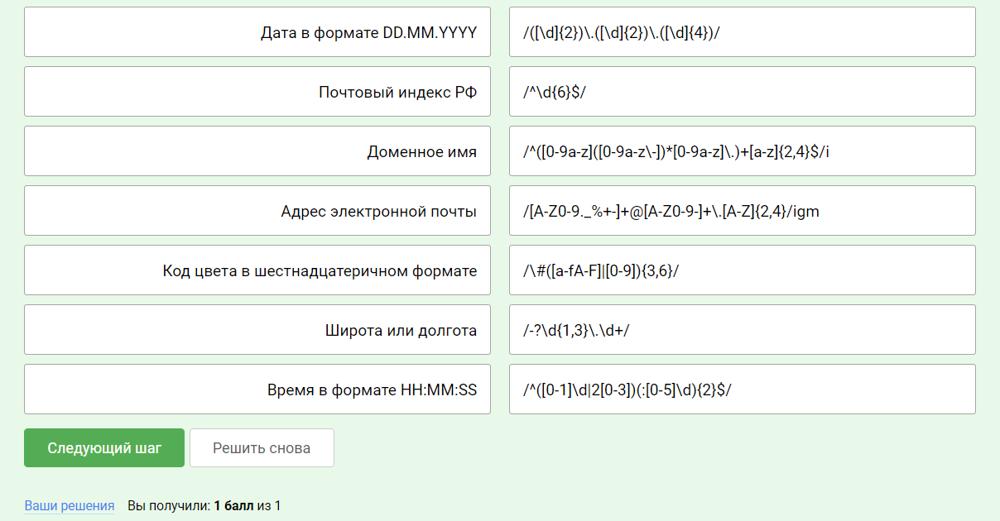
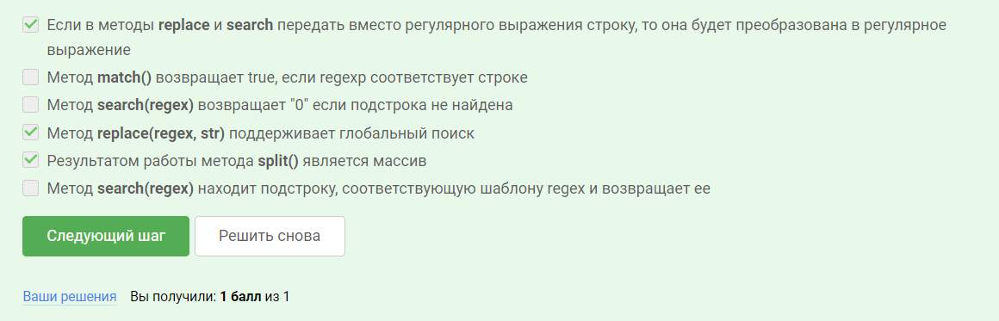
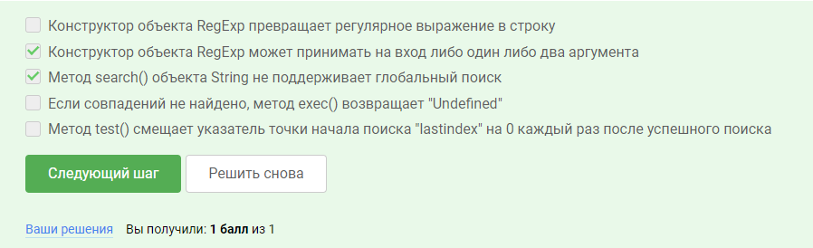
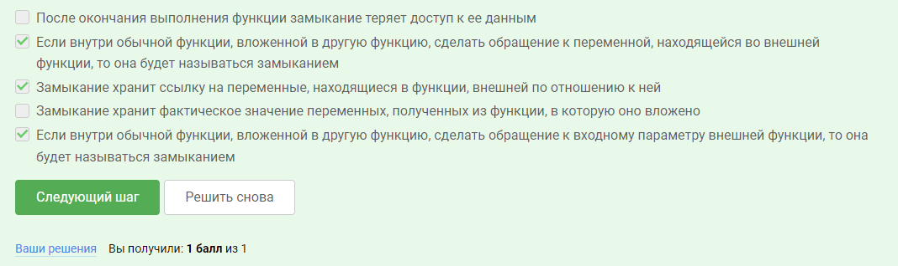
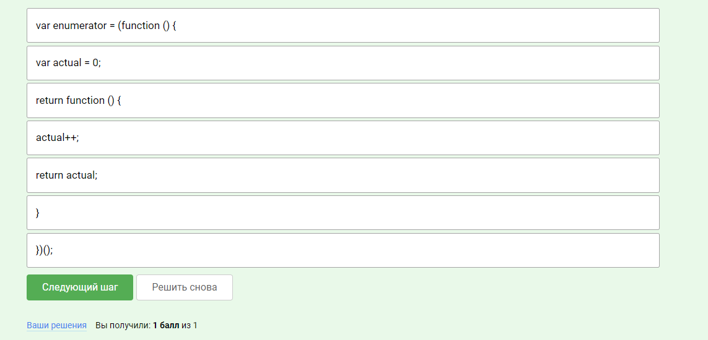

# Ответы на письменные вопросы 

## Обработка ошибок 

- Как вы считаете, исключение можно : ...

- Выберите правильные варианты

## Введение в регулярные выражения

- Задача на разминку. 
Укажите регулярные выражения, которые будут соответствовать какой-либо подстроке в строке http://www.stepik.org

- Отметьте выражения, которые будут соответствовать строкам или подстрокам.

- Сопоставьте регулярное выражение  типу данных, которым оно соответствует

## Использование регулярных выражений

- Теперь посмотрим, насколько понятно был изложен материал по методам объекта  String, работающим с регулярными выражениями.

- Давайте проверим, что мы усвоили про объект RegExp.

## Замыкания

- Для начала - небольшой тест!

- А теперь - задача на... программирование!)
В тексте внизу описана анонимная функция, внутри которой находится замыкание, изменяющее значение переменной во внешней функции и возвращающее ее. Но вот проблема - строчки перепутались местами! Восстановите необходимую последовательность строк.

